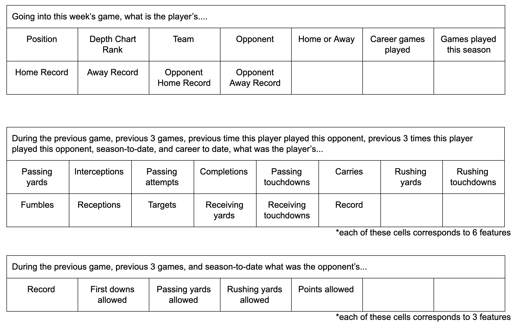
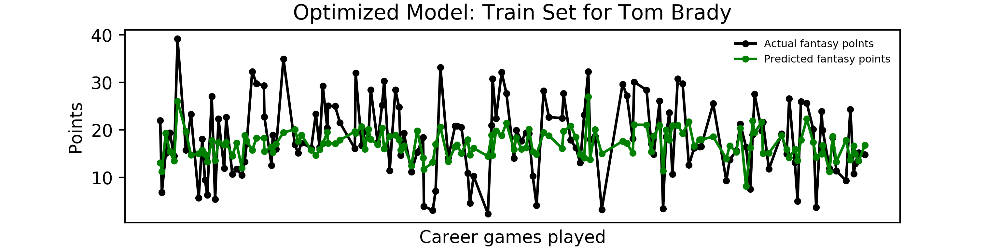
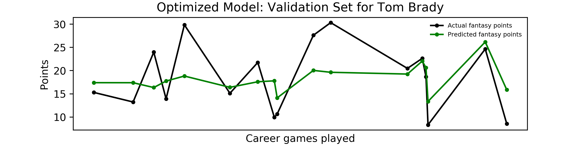
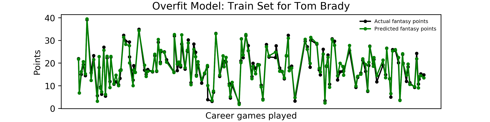
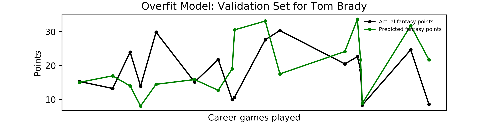
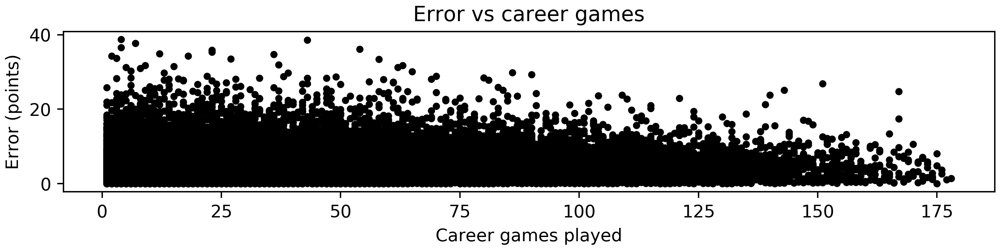

# fantasy_football

_why predicting fantasy football points is so hard_

#

As a person who both loves and hates fantasy football, one of the things I love to hate are the points predictors provided by the various platforms.

Admittedly, I've never actually evaluated one of these points predictor's accuracy, but, to be fair, the predictions sort of disappear after a game has finished (I like to think it's because the predictors are trying to hide their shame from the world). After one "your-team-is-projected-to-win-by-10-but-loses-by-20" too many, I decided to try to build a predictor myself. I wanted to see if, as I often exclaim when watching a football game, I could do better than the pros and catch that metaphorical touchdown.​

Long story short: I can't do better than the pros. Long story less short: It's actually quite an interesting problem that I now better understand why it's hard to solve. One of the main goals of this writeup is to provide intuition behind what makes this problem so challenging.

## Data and Model

As many an experienced data scientist would say: the key to the problem lies in the data, not the model. And I think this problem is no exception. If points are predictable, that prediction will rely on a model finding a sufficient pattern in the myriad of stats collected about football games. Things like how many carries/targets/ receptions/rushing yards/passing yards etc. did a player have in their last game/last 2 games/last n games/season-to-date/career-to-date etc.

One can easily see how there are a lot of potential stats and therefore potential input features. After much rumination and, using what football knowledge I had from many Sunday Ticket Sundays, I settled upon the following 3 tables of input features that my model will use to predict how many points a player will get that week.

I acquired this data from two sources: the [nflgame api](https://github.com/derek-adair/nflgame) and [ourlads.com](https://www.ourlads.com/nfldepthcharts/archive/40/SF). nflgame had the performance of each player in each game going back to 2009, which I processed to calculate the relevant input features. nflgame did not have the depth chart position, however, so I scraped ourlads to get depth chart position back till 2009 as well.

I treated each time a player scored fantasy points as a different event and, therefore, a different training example. The idea is that this model should be able to take in this series of input features, regardless of who that player actually is, and predict fantasy points. This means that the number of training examples I have is the number of times, since 2009, a player has played a game and gotten fantasy points (I did filter out players who averaged <1 point and played <3 games). This results in approximately 50,000 training examples, but really 40,000 since I reserved 5,000 each for validation and testing sets. This, unfortunately, is not that large of a training set, and I think this is one of the key challenges of this problem, as I'll discuss later on.

My model was a relatively standard neural network that I built using keras. I found my best model had a layer structure of [256, 256, 128, 128, 64, 64, 32, 32, 1], a learning of rate of 0.001, and a batch size of 32 with "relu" activation functions for all the layers except the last one. For my loss function, I used mean squared error between the predicted fantasy points and the actual fantasy points scored (calculated assuming half ppr).

This model was able to achieve a minimum average error (difference between prediction and actual fantasy points scored) of about 4.5 points on the test set. This error was achieved after about 10 - 20 training epochs.

If additional epochs were run, the model was able to overfit the training set such that the average error was < 1 point. Regularization strategies, such as L1 normalization and dropout, were not able to significantly improve the model, but examination of training example outputs, as I'll do in the next section, sheds some light on why regularization wasn't able to help, and why this is such a challenging problem. So let's get to it!

## Evaluating the Model

To better grasp how this model performed, I plotted the predictions for everyone's favorite player, Tom Brady (sorry, bad joke), over the course of his career. The first two plots below are of Brady's games that were in the training set and validation set, respectively. A clear trend is apparent: the model likes to play it safe and predict a sort of rolling average of how Brady did over his career. And this makes perfect sense, given our loss function. The loss function is trying to minimize the square distance between the predicted points and the actual points. The easiest way to minimize that is to just predict the average.

A closer look at the validation data also shows that the model does generally trend the correct direction when predicting if Brady will do better or worse than his average in a given week. The part that the model struggles with is correctly guessing the magnitude with which he'll do better or worse. Essentially, it can somewhat tell if he will boom or bust this week, but it can't really tell by how much.

I also plotted the training and validation sets for Brady from an overfitted model that I trained for 400 epochs. From the first plot below we see that this model has clearly learned how to predict Brady's points very accurately across the training set. It has effectively learned how to deviate from a rolling average and predict the boom and bust magnitude. Unfortunately, it can't generalize this to a validation set, as seen in the second plot below. What's interesting though is the overtrained model is not afraid to predict high boom and low bust values anymore. The issue is that the booms and busts it predicts don't line up with the actual booms and busts. This is also why regularization didn't really help. It just squished the boom and bust magnitudes closer to the average, but did not help the model learn when a significant boom or bust was supposed to happen.

This tells an interesting story of how this model works. At first during its training, it quickly learns how to predict a rolling average for a player, but is skittish to predict values that deviate significantly from that average. If you keep training though, forcing it to continually minimize loss, the model will, on the training set, find a way to fit those boom and bust magnitudes correctly. Unfortunately, it's not actually learning a generalizable way to correctly predict these boom and bust magnitudes on the validation or test set. It's found a pattern to predict boom and bust magnitude, just not the correct one.

## How Can We Make the Model Better

The plot below provides some insight into what the limiting factor may be for this model. I scatter plotted the error for each of the ~40,000 training examples vs the career game associated with that training example. This shows that the error tends to decrease for predictions later on in a player's career. This makes sense since the model has more data to work with to more accurately predict how that player will perform.

This also means that more training examples may be the key to improving this model!

Unfortunately, since the nflgame api only has data starting in 2009, getting more data is not a trivial endeavor. Even if we could get data from the past 20 years, instead of the last 10, we would only have 100,000 training examples, which is still not that many. And even if we could go back further, we would potentially run into issues where the game was played differently and the distribution of that data may be different.

Another potential strategy for improving this model would be to expand the input features. I chose the ones that were readily available in online datasets, but one could imagine that there are additional factors (such as weather), that could be helpful. But there's a tradeoff there as well. Spending a lot of time and effort to get as many details as you can, such as what Tom Brady had for breakfast that morning, may not be as helpful as just having more games Tom Brady has played.

Another factor to consider is that this may not be a very predictable problem. After all, there's a whole billion dollar gambling industry that relies on people and experts, more often than not, being wrong about what's going to happen during a football game. Having watched a lot of football in my life, one thing you feel in your gut is that anything can happen at any time. Games, seasons, and careers are decided by a ball being one inch to the left (see Russell Wilson's superbowl loss). One has to ask at some point: how much of football is really just unpredictable randomness?

The answer to this question, as is true for a lot of problems in this field, can likely be found with more data.
